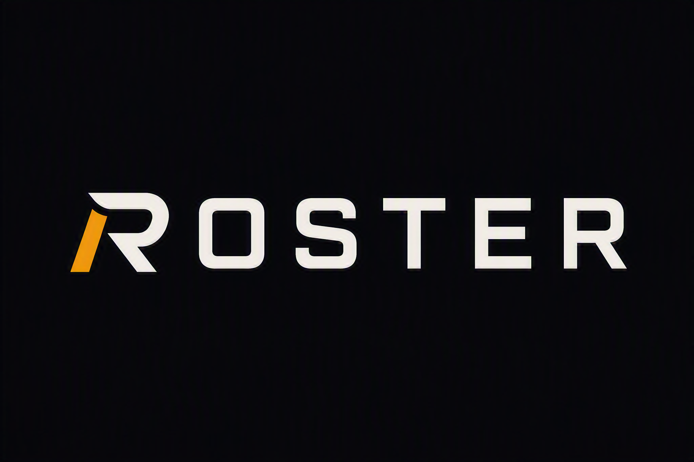

<p align="center">
  
</p>

<h1 align="center">ROSTER</h1>
<p align="center"><b>A private, local-first front office for one man's personal media collection.</b></p>

<p align="center">
  
  
  
  
  
</p>

---

Every collection deserves a front office. **Roster** is that front office — a mobile‑first Progressive Web App that turns a personal media library into something with a roster, a schedule, a scouting department, and a stat sheet.

The tape stays on your storage. Roster never hosts, streams, or serves the underlying files. What it manages is everything *around* them: who's on the roster, what they're tagged for, when they last saw the field, how they graded out, and who's due for a call-up.

> **The mission:** the bigger the collection gets, the *easier* it should be to run — not harder.

---

## Table of Contents

- [Why Roster Exists](#why-roster-exists)
- [The Front Office](#the-front-office) — feature tour
- [League Structure](#league-structure) — how the physical collection is organized
- [File Naming Convention](#file-naming-convention)
- [Data Model](#data-model)
- [Architecture](#architecture)
- [Tech Stack](#tech-stack)
- [Project Structure](#project-structure)
- [Getting Started](#getting-started)
- [Available Scripts](#available-scripts)
- [Deployment](#deployment)
- [Import / Export](#import--export)
- [Privacy](#privacy)
- [Roadmap](#roadmap)
- [Design Principles](#design-principles)
- [License](#license)

---

## Why Roster Exists

A folder of files can only answer one question: *what do I have?*

Roster is built to answer the questions that actually matter for a collection that's grown past the point of memory:

- What is this, and where does it belong?
- What have I actually watched — and what's just taking up a roster spot?
- What consistently performs, and what's dead weight?
- What have I slept on that deserves another look?
- Where is my metadata thin, wrong, or duplicated?

That means Roster isn't one app so much as five, running under one roof:

**Roster · Session Ledger · Scouting Report · Discovery Engine · Data Integrity Desk**

It's opinionated on purpose. It isn't trying to be a general-purpose media manager — it's built around one collection, one owner, and one way of browsing: fast, on a phone, with real signal instead of noise.

---

## The Front Office

Roster is organized like a sports operation. Here's who does what.

### 🏟️ Overview — the home page
The daily scoreboard: roster size, recent call-ups, hot streaks, and a snapshot of what's trending before you even open a tab.

### 📋 Roster (Collection)
The full active roster — grid or ranked list — with every unit's folder placement, performer credits, tags, resolution, and rating on display. This is the browse-and-filter home base, built for fast mobile scanning over deep menus.

### ⚡ Quick Add
Sign a new player in under 60 seconds. Drop in a filename, Roster parses performers, title, tags, and resolution straight out of the naming convention — you confirm and move on. Enrich later; capture now.

### 📓 Session Ledger
The box score. Every rotation gets logged — date, duration, which videos were in play, how it graded out (1–5), orgasm status, vibe, and whether it was a *strong combination* worth remembering. This is the behavioral half of the system: not what you own, but what you actually do with it.

### 🎯 The Lineup (Watchlist)
Your active queue — what's next in rotation, what needs research, and what's flagged for rediscovery. Three lanes, one list, zero decision fatigue.

### 🔎 Discovery & Rotation
The scouting department. Ten distinct discovery modes pull from the archive with a real strategy behind each one:

| Mode | Intent |
|---|---|
| **Surprise Me** | Balanced pull across favorites and novelty |
| **Blind Pull** | Zero preconceptions, no weighting |
| **High Signal** | Strictly from your top-rated, proven performers |
| **Unwatched** | Fresh territory — zero logged sessions |
| **Rediscover** | Liked before, untouched in 30+ days |
| **Deep Cut** | Rare, low-visibility, worth a second look |
| **Old Favorite** | Former hits worth a rematch |
| **Category Explorer** | Deliberate dive into one folder, tag, or performer |
| **Gap Explorer** | Surfaces underrepresented corners of the collection |
| **Random** | Exactly what it says |

### 📊 Behavioral Intelligence (Analytics)
The stat sheet. Ownership vs. usage, tag and performer performance, folder health, combination dynamics, and metadata hygiene — all computed from real session history, not vibes.

### 🧭 Guide
The rulebook: the tagging vocabulary, rating scale, orgasm-status legend, and discovery-mode glossary, all in one reference page.

### ⚙️ Settings / More
Front-office administration — vocabularies, thresholds, preferences, playback bridge configuration, and import/export.

---

## League Structure

The physical collection follows a deliberately shallow hierarchy, organized primarily by participant count:

```text
Collection/
├── Favorites/
├── Solo/
│   ├── Monster & Huge/
│   ├── Public & Risky/
│   └── Other Solo/
├── Duo/
│   ├── Monster / XXL / Size/
│   ├── Hard & Rough / Intense/
│   ├── Latino / Ethnic/
│   ├── Muscle / Chav / Bro/
│   ├── Roleplay / Power / Taboo/
│   └── Other Duo/
├── Threesome/
│   ├── DP / Tag-Team / Size+Intense/
│   ├── Hard & Rough / Power/
│   └── Other Threesome/
└── Group/
    ├── Gangbang / Cumdump/
    └── Other Group/
```

**Placement rules, in order:**

1. Determine participant count → top-level category.
2. Identify the strongest remaining browse signal (size → intensity → taboo/power → muscle → ethnicity → other).
3. Drop into the matching subfolder; use `Other` when no signal dominates.
4. One file, one home — never duplicate a placement.

A catch-all `Other` folder graduates into its own category once a coherent theme hits roughly **6–8 items**. Folders aim for ~12 items, with **18–20 as the practical mobile-browsing ceiling**.

---

## File Naming Convention

Every file follows a fixed three-part format so the filename itself carries metadata, even when thumbnails don't load on mobile:

```text
Performers | Descriptive Title | Key Tags [Resolution]
```

```text
Performer A & Performer B | Descriptive Scene Title | Size, Rough, Public [1080p]
```

Roster's parser (`src/engines/parser.ts`) reads this format directly on **Quick Add**, extracting performers, title, tags, and resolution automatically. Original and normalized values are both retained, so cleanup never destroys provenance.

---

## Data Model

Six entities, related by stable IDs rather than duplicated data:

| Entity | Role |
|---|---|
| **Video** | Canonical record for one collection item — performers, tags, folder, rating, provenance |
| **Session** | A logged rotation — date, videos involved, grade, vibe, notes |
| **Performer** | Normalized identity, referenced (not copy-pasted) across videos |
| **Tag** | Canonical, categorized descriptor with synonym matching |
| **Watchlist Item** | A queued item with status (next up / research / rediscover) |
| **Collection Settings** | Vocabularies, thresholds, preferences, playback config |

**Provenance is first-class.** Every field on a `Video` can carry a confidence level, so the system never treats a guess and a confirmed fact the same way:

```text
raw → parsed → research-confirmed → user-confirmed
```

This matters most in the 30-tag canonical vocabulary (`src/data/canonicalTags.ts`), split across four categories — *Archetype & Identity, Sexual Dynamic & Vibe, Acts & Mechanics, Context & Setting* — each with synonym lists so messy imported tags reconcile against a clean, consistent taxonomy instead of sprawling indefinitely.

---

## Architecture

Roster keeps a hard line between **data**, **logic**, and **presentation**:

```text
Raw records (IndexedDB)
        │
        ▼
  Domain engine  ← analytics, discovery, integrity, parser, reconciliation, history, importExport
        │
        ▼
Normalized result
        │
        ▼
   UI component  ← renders only, never recalculates
```

Every engine in `src/engines/` is a pure(ish), independently testable TypeScript module — no React, no DOM. That's what `npm test` exercises directly (see [`selfCheck.ts`](src/utils/selfCheck.ts)): canonical tag coverage, parser behavior, schema migrations, integrity auditing, analytics output, and all ten discovery modes, without spinning up a browser.

**Why it's built this way:**
- Analytics and discovery logic can be tested and reasoned about in isolation.
- The UI layer stays dumb on purpose — it renders what the engines decide.
- Reconciliation and integrity checks are *inspectable*, never silent. Nothing auto-fixes ambiguous metadata behind your back.

---

## Tech Stack

| Layer | Choice |
|---|---|
| UI | React 19 + TypeScript, React Router 7 |
| Styling | Tailwind CSS 4 (via `@tailwindcss/vite`), `clsx` / `tailwind-merge` |
| Motion | `motion` (Framer Motion successor) |
| Icons | `lucide-react` |
| Storage | IndexedDB via [`idb`](https://github.com/jakearchibald/idb) — fully local, no backend database |
| Build | Vite 6 |
| PWA | Custom service worker + manifest, installable, offline-capable |
| AI (optional) | `@google/genai` dependency scaffolded for future enrichment features — see [Roadmap](#roadmap) |
| Testing | `tsx`-run self-check suite (`npm test`), `tsc --noEmit` for type-safety (`npm run lint`) |

---

## Project Structure

```text
Roster/
├── public/
│   ├── brand/                  # Roster logo + wordmark
│   ├── site.webmanifest        # PWA manifest
│   └── sw.js                   # Service worker
│
├── src/
│   ├── components/
│   │   ├── ReconciliationPanel.tsx
│   │   └── ui/                 # Badge, MediaCard, PageHeader, TagChip, etc.
│   │
│   ├── context/
│   │   └── PlaybackContext.tsx # External playback-app bridge state
│   │
│   ├── data/
│   │   ├── canonicalTags.ts    # The 30-tag vocabulary
│   │   └── seedList.ts
│   │
│   ├── engines/                # All business logic — framework-agnostic
│   │   ├── analytics.ts        # Behavioral Intelligence
│   │   ├── discovery.ts        # 10 discovery modes
│   │   ├── history.ts          # Per-video watch history
│   │   ├── importExport.ts     # Backup / restore
│   │   ├── integrity.ts        # Data quality auditing
│   │   ├── parser.ts           # Filename → structured metadata
│   │   └── reconciliation.ts   # Duplicate + mismatch detection
│   │
│   ├── pages/                  # One file per route (Overview, Collection,
│   │                           #  Sessions, Discovery, Analytics, Guide, …)
│   │
│   ├── storage/
│   │   ├── db.ts                # IndexedDB schema + access layer
│   │   └── migrations.ts        # Versioned schema migrations
│   │
│   └── types/                  # Shared TypeScript contracts
│
└── scripts/
    └── generateIcons.js         # PWA icon generation
```

---

## Getting Started

**Requirements:** Node.js 20+

```bash
git clone https://github.com/Infinitive/Roster.git
cd Roster
npm install
npm run dev
```

The dev server runs at `http://localhost:3000` with hot reload. Roster is fully client-side — there's no backend to stand up. Open it, and it'll seed its own local IndexedDB store on first load.

---

## Available Scripts

| Command | What it does |
|---|---|
| `npm run dev` | Start the Vite dev server (port 3000) |
| `npm run build` | Type-check-free production build → `dist/`, with a `404.html` copy for SPA routing on static hosts |
| `npm run preview` | Serve the production build locally |
| `npm run lint` | Type-check the whole project (`tsc --noEmit`) |
| `npm test` | Run the engine self-check suite (tags, parser, migrations, integrity, analytics, all 10 discovery modes) |
| `npm run clean` | Remove build output |

---

## Deployment

Roster ships as a static PWA. The included GitHub Actions workflow (`.github/workflows/deploy.yml`) builds on every push to `main` and deploys straight to GitHub Pages — no server, no database to provision.

To deploy elsewhere, run `npm run build` and serve the `dist/` folder from any static host. Set `VITE_BASE_PATH` if the app isn't served from the domain root.

---

## Import / Export

Everything Roster knows lives in your browser's IndexedDB — which means it's also yours to move. The **Settings** page exports a complete, versioned JSON snapshot (videos, sessions, performers, tags, watchlist, settings) and can re-import it with full validation: schema-version checks, integrity auditing, and duplicate detection before anything touches your live data. Nothing is imported silently — you see what changed before it's committed.

---

## Privacy

This repository is public. The collection it describes is not.

- No physical media files, thumbnails, or personally identifying content live in this repo.
- All application data is stored locally in the browser via IndexedDB — nothing is transmitted to a remote server by default.
- The optional AI dependency requires the user's own API key, configured locally; Roster does not ship one.

---

## Roadmap

```text
Phase 1 — Foundation           Stable registry, local storage, browsing, sessions, watchlist, import/export ✅
Phase 2 — Intelligence         Normalized tag/performer/folder analytics, behavioral scoring
Phase 3 — Discovery            Opportunity analysis, ownership-vs-usage gaps, temporal trends
Phase 4 — Assistance           AI-assisted metadata enrichment (provenance-tracked, never auto-trusted)
Phase 5 — Maturity             A fully self-maintaining personal media intelligence system
```

Roster currently sits across Phases 1–2, with Discovery and integrity tooling already live. The `@google/genai` dependency is scaffolded for Phase 4 but not yet wired into the app — when it lands, AI output will flow through the same provenance system as everything else (`raw → parsed → research-confirmed → user-confirmed`), so it can augment metadata without ever silently overwriting something you confirmed yourself.

---

## Design Principles

1. **Don't become a generic media manager.** Every feature is built for this collection and this browsing pattern, not "what media apps usually have."
2. **Keep the hierarchy shallow.** No nested navigation until real volume demands it.
3. **The registry describes the collection — it isn't the collection.** Physical files stay off-repo, always.
4. **Relationships over duplication.** Performers, tags, sessions, and videos stay independently modeled.
5. **Logic lives in engines, not components.** UI renders; engines decide.
6. **Preserve provenance.** Never collapse *raw*, *parsed*, *researched*, and *confirmed* into one undifferentiated blob.
7. **Never silently touch user data.** Imports are validated. Reconciliation is inspectable. Nothing auto-corrects behind your back.
8. **Design for touch first.** Desktop is a bonus, not the target.
9. **Optimize for decisions, not metrics.** A stat only earns a place on the page if it changes what you do next.

---

## License

Application source carries Apache-2.0 SPDX headers. No standalone `LICENSE` file is currently checked into the repository root — until one is added, treat the existing header convention as authoritative for reuse.

---

<p align="center"><sub>Built for one collection, one owner, one roster. Not trying to be everyone's app — just the right one for this team.</sub></p>
